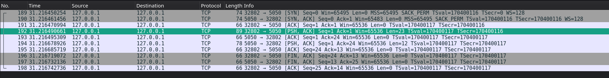

# Interface trong các hệ phân tán

## Câu 1: Interface trong hệ thống phân tán là gì? Tại sao cần phải có Interface khi triển khai các dịch vụ?

Trả lời:

Interface trong các hệ thống phân tán là tập hợp các đặc tả về cú pháp và ngữ nghĩa của dịch vụ. Việc triển khai dịch vụ tuân thủ theo Interface sẽ giúp các thành phần phần mềm khác nhau, chạy trên các máy tính riêng biệt có thể tương tác và giao tiếp với nhau.

## Câu 2: Hãy giải thích ý nghĩa của mã trạng thái 201 CREATED, 204 NO_CONTENT và 404 NOT_FOUND trong giao thức KVSS

Trả lời:

201 CREATED: Đây là trạng thái trả về sau khi tạo cặp key/value mới thành công

204 NO_CONTENT: Đây là trạng thái trả về sau khi đã xoá cặp key/value thành công

404 NOT_FOUND: Đây là trạng thái trả về khi server không tìm thấy cặp key/value được lưu ở phía server

## Câu 3: Trong bài lab KVSS, nếu client không tuân thủ quy ước Interface (ví dụ: thiếu version KV/1.0), server sẽ phản hồi thế nào? Tại sao phải quy định rõ ràng tình huống này?

Nếu không tuân thủ quy ước của Interface, server sẽ trả về các mã lỗi

- 426 UPGRADE_REQUIRED nếu thiếu / sai version
- 400 BAD_REQUEST nếu sai tên phương thức

## Câu 4: Quan sát một phiên làm việc qua Wireshark: hãy mô tả cách mà gói tin TCP được chia để truyền thông điệp theo “line-based protocol”

Trả lời:

Sau quá trình bắt tay 3 bước, client và server bắt đầu trao đổi dữ liệu.

Trong giao thức "line-based protocol" mỗi thông điệp được coi là 1 dòng văn bản và được kết thúc bằng một ký tự xuống dòng (ở đây là LF). Tuy nhiên, TCP không nhận biết khái niệm "line-based" mà truyền các luồng byte liên tục, do đó, các dòng có thể được chia thành các segment có kích thước phù hợp. Nếu kích thước dòng đủ nhỏ (như đa phần các thông điệp trong KVSS đơn giản này), dòng đó sẽ nằm trọn vẹn trong gói tin TCP.

## Câu 5: Giả sử có một client viết sai giao thức (gửi KV/1.0 POTT user42 Alice). Server sẽ xử lý như thế nào? Kết quả này thể hiện đặc điểm gì của Interface?

Trả lời:

Khi client viết sai giao thức, server sẽ báo lỗi 400 BAD_REQUEST về client đó.

Kết quả này thể hiện tính chuẩn hoá của Interface. Client và server phải tuân thủ các quy ước của Interface để giao tiếp. Interface giúp việc giao tiếp giữa client và server trở nên dự đoán được, dễ nắm bắt vấn đề khi server trả về mã lỗi nào đó.

## Câu 6: Sau khi chạy `kubectl apply -f users-deploy.yaml`, dùng lệnh nào để kiểm tra Pod của service users đã chạy thành công? Hãy chụp màn hình kết quả

Để kiểm tra trạng thái của service users, có thể sử dụng câu lệnh

`kubectl get pods -l app=users`

Nếu users service đã chạy thành công, nó sẽ được hiển thị lên danh sách với status là `running`

## Câu 7: Trong file `users-deploy.yaml` hãy chỉ ra: deployment quản lý bao nhiêu replica ban đầu, service thuộc loại nào (ClusterIP, NodePort, LoadBalancer)

Trong `users-deploy.yaml`, deployment quản lý 1 replica ban đầu.

Do không chỉ định `spec.type` cụ thể, service này thuộc loại mặc định là ClusterIP

## Câu 8: Sau khi cài Ingress, em cần thêm dòng nào vào file `/etc/hosts` để truy cập bằng tên miền `micro.local`

Sau khi cài Ingress, cần lấy IP của Ingress `minikube ip`, sau đó lấy giá trị IP đó thêm vào `/etc/host`:

`<MINIKUBE_IP> micro.local`
